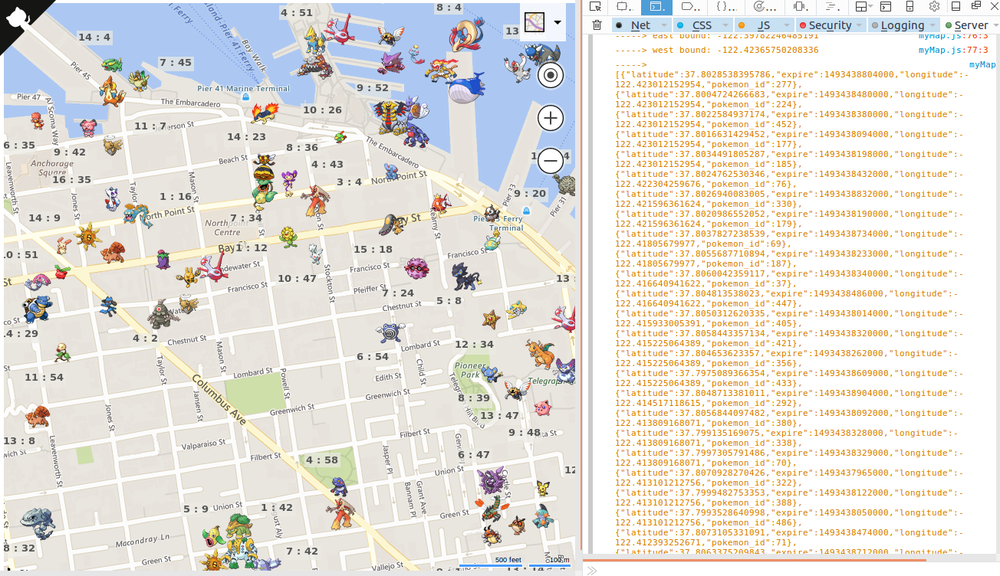
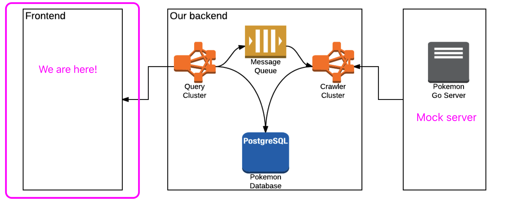

# PokemonGo Map Demo

>Disclaimer: This is a POC(proof of concept) project for education purpose.

## Data source
All Pokemon data, which are essentially fake, are generated randomly by a [mock API](https://github.com/hackjutsu/mock_pgoapi). In principle, there is no communction between the crawlers and the real Pokemon Go servers.

## How it works?

1. A web app sends requests with locations to an AWS API gateway
2. Said AWS API gateway routes said requests to a query cluster
3. Said query cluster queries for Pokemons data by said locations from a PostgreSQL database on AWS
4. Said database returns Pokemons data within said locations
5. Said query cluster returns said Pokemons data to said web app
4. Said query cluster sends said locations to an message queue
5. A crawler cluster retrieves said locations from said message queue
6. Said crawler cluster gets fake Pokemons data from a mock Pokemon go api
7. Said crawler cluster saves said fake Pokemons data to said PostgreSQL database on AWS

## License
MIT
